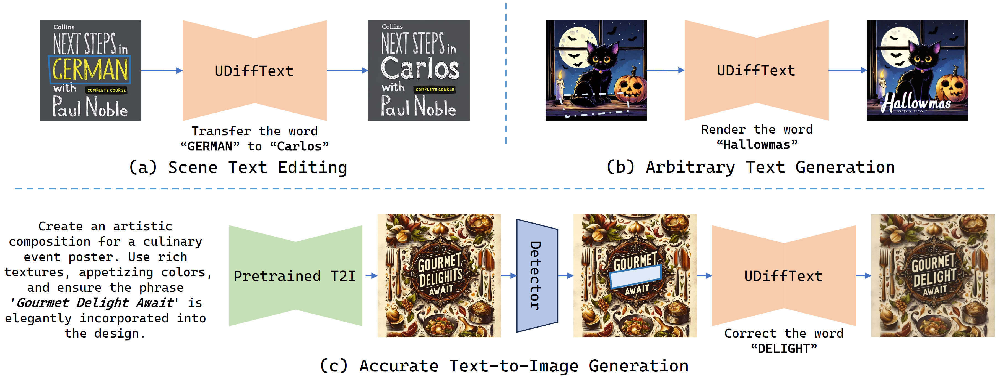
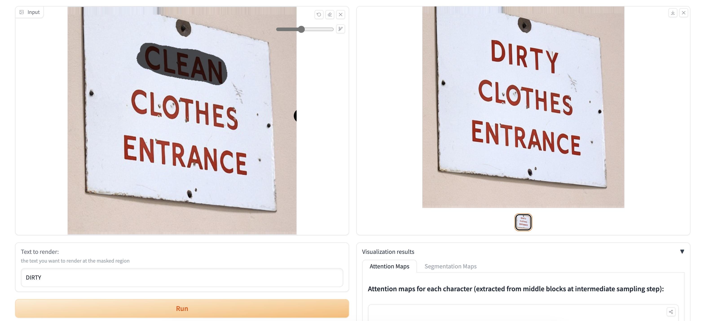

## UDiffText: A Unified Framework for High-quality Text Synthesis in Arbitrary Images via Character-aware Diffusion Models

<a href='https://arxiv.org/abs/2312.04884'></a> 
<a href='https://udifftext.github.io/'></a> 
<a href='https://huggingface.co/spaces/ZYMPKU/UDiffText'></a> 

#### Our proposed UDiffText is capable of synthesizing accurate and harmonious text in either synthetic or real-word images, thus can be applied to tasks like scene text editing (a), arbitrary text generation (b) and accurate T2I generation (c)



### 📬 News

- **2023.12.11** Version 2.0 update (getting rid of trash codes🚮)
- **2023.12.3** Build Hugging Face demo
- **2023.12.1** Build Github project page
- **2023.11.30** Version 1.0 upload

### 🔨 Installation

1. Clone this repo: 
```
git clone https://github.com/ZYM-PKU/UDiffText.git
cd UDiffText
```

2. Install required Python packages

```
conda create -n udiff python=3.11
conda activate udiff
pip install -r requirements.txt
```

3. Make the checkpoint directory and build the tree structure

```
mkdir ./checkpoints

checkpoints
├── AEs                    // AutoEncoder
├── encoders             
    ├── LabelEncoder       // Character-level encoder
    └── ViTSTR             // STR encoder
├── predictors             // STR model
├── pretrained             // Pretrained SD
└── ***.ckpt               // UDiffText checkpoint
```

### 💻 Training

1. Prepare your data

- Create a data directory **{your data root}** in your disk and put your data in it. Then set the **data_root** field in **./configs/dataset/locr.yaml**.
- For the downloading and preprocessing of Laion-OCR dataset, please refer to [TextDiffuser](https://github.com/microsoft/unilm/tree/master/textdiffuser) and our **./scripts/preprocess/laion_ocr_pre.ipynb**.

2. Train the character-level encoder

Set the parameters in **./configs/pretrain.yaml** and run:

```
python pretrain.py
```

3. Train the UDiffText model

Set the parameters in **./configs/train.yaml**, especially the paths:

```
load_ckpt_path: ./checkpoints/pretrained/512-inpainting-ema.ckpt // Checkpoint of the pretrained SD
model_cfg_path: ./configs/train/textdesign_sd_2.yaml // UDiffText model config
dataset_cfg_path: ./configs/dataset/locr.yaml // Use the Laion-OCR dataset
```

and run:

```
python train.py
```

### 📏 Evaluation

1. Download our available [checkpoints](https://drive.google.com/drive/folders/1s8IWqqydaJBjukxViGKFj2N33lfoVkGf?usp=sharing) and put them in the corresponding directories in **./checkpoints**.

2. Set the parameters in **./configs/test.yaml**, especially the paths:

```
load_ckpt_path: "./checkpoints/***.ckpt"  // UDiffText checkpoint
model_cfg_path: "./configs/test/textdesign_sd_2.yaml"  // UDiffText model config
dataset_cfg_path: "./configs/dataset/locr.yaml"  // LAION-OCR dataset config
```

and run:

```
python test.py
```

### 🖼️ Demo

In order to run an interactive demo on your own mechine, execute the code:

```
python demo.py
```

or try our online demo at [hugging face](https://huggingface.co/spaces/ZYMPKU/UDiffText):



### 🎉 Acknowledgement

- **Dataset**: We sincerely thank the open-source large image-text dataset LAION-OCR with character-level segmentations provided by [TextDiffuser](https://github.com/microsoft/unilm/tree/master/textdiffuser).

- **Code & Model**: We build our project based on the code repo of [Stable Diffusion XL](https://github.com/Stability-AI/generative-models) and leverage the pretrained checkpoint of [Stable Diffusion 2.0](https://github.com/Stability-AI/stablediffusion).

### 🪬 Citation

```
@misc{zhao2023udifftext,
      title={UDiffText: A Unified Framework for High-quality Text Synthesis in Arbitrary Images via Character-aware Diffusion Models}, 
      author={Yiming Zhao and Zhouhui Lian},
      year={2023},
      eprint={2312.04884},
      archivePrefix={arXiv},
      primaryClass={cs.CV}
}
```